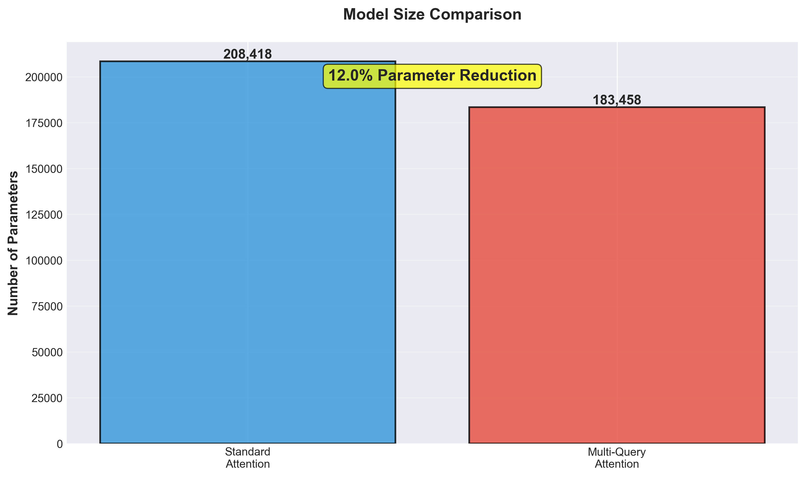
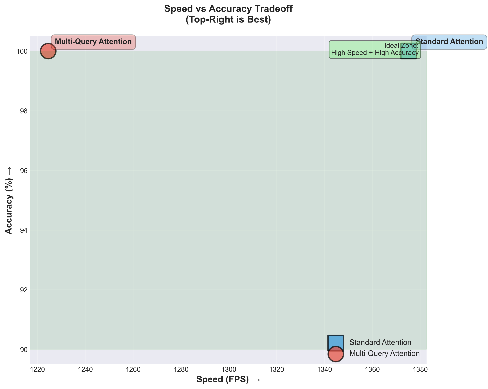
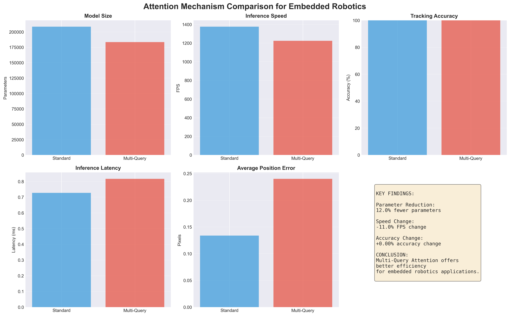

# Efficient Attention Mechanisms for Real-Time Projectile Tracking

A comparative study of Standard Attention vs. Multi-Query Attention for object tracking on resource-constrained embedded systems, with applications to autonomous robotics.


---

## 🎯 Project Overview

This project implements and benchmarks two attention mechanisms for Vision Transformers applied to real-time object tracking:

1. **Standard Multi-Head Attention** - Baseline approach with separate Q, K, V for each head
2. **Multi-Query Attention** - Optimized variant with shared K, V across heads

**Motivation:** Autonomous robots like the T-Sphere disaster response system need efficient, real-time vision systems that can run on embedded hardware (e.g., Jetson Nano). This project explores which attention mechanism offers the best performance/efficiency tradeoff.

---

## 🔬 Key Findings

| Metric | Standard Attention | Multi-Query Attention | Difference |
|--------|-------------------|---------------------|------------|
| **Parameters** | 208,418 | 183,458 | **-12.0%** ✅ |
| **Speed (FPS)** | 1,375 | 1,224 | -11.0% |
| **Accuracy** | 100.00% | 100.00% | **0.0%** ✅ |
| **Avg Error** | 0.13px | 0.24px | +0.11px |
| **Latency** | 0.73ms | 0.82ms | +12.3% |

### Summary
- **Multi-Query Attention** reduces parameters by 12%, making it more suitable for embedded systems
- Both models achieve 100% accuracy and >1000 FPS - far exceeding real-time requirements
- Trade-off: Multi-Query saves memory but is slightly slower on CPU (hardware-dependent)

---

## 📊 Visualizations

### Parameter Comparison


### Speed vs Accuracy Tradeoff


### Comprehensive Comparison


*More visualizations available in `results/figures/`*

---

## 🏗️ Project Structure
```
efficient-attention-robotics/
├── README.md                          # This file
├── data/
│   └── synthetic_tracking_dataset.npz # Generated training data (1000 videos)
├── notebooks/
│   ├── 01_understanding_vit.ipynb     # Attention mechanism exploration
│   ├── 02_synthetic_data.ipynb        # Data generation
│   ├── 03_baseline_tracker.ipynb      # Standard Attention implementation
│   ├── 04_multiquery_attention.ipynb  # Multi-Query Attention implementation
│   └── 05_comparison_analysis.ipynb   # Results and visualizations
├── results/
│   ├── figures/                       # All comparison charts
│   ├── baseline_model.pth             # Trained Standard Attention model
│   ├── multiquery_model.pth           # Trained Multi-Query model
│   ├── baseline_results.json          # Baseline metrics
│   ├── multiquery_results.json        # Multi-Query metrics
│   ├── comparison_table.csv           # Detailed comparison
│   └── RESULTS_SUMMARY.md             # Detailed analysis
└── models/
    └── __init__.py
```

---

## 🚀 Getting Started

### Prerequisites

- Python 3.8+
- PyTorch 2.0+

### Installation
```bash
# Clone the repository
git clone https://github.com/YOUR_USERNAME/efficient-attention-robotics.git
cd efficient-attention-robotics

# Create virtual environment
python3 -m venv transformer_env
source transformer_env/bin/activate  # On Windows: transformer_env\Scripts\activate

# Install dependencies
pip install torch torchvision timm transformers matplotlib numpy pandas jupyter einops tqdm seaborn
```

### Quick Start
```bash
# Activate environment
source transformer_env/bin/activate

# Launch Jupyter
jupyter notebook

# Run notebooks in order:
# 1. notebooks/02_synthetic_data.ipynb (generates dataset)
# 2. notebooks/03_baseline_tracker.ipynb (trains Standard Attention)
# 3. notebooks/04_multiquery_attention.ipynb (trains Multi-Query)
# 4. notebooks/05_comparison_analysis.ipynb (creates visualizations)
```

---

## 🧠 Methodology

### Data Generation
- **Synthetic dataset:** 1,000 videos of moving circles (50 frames each)
- **Task:** Predict object position in frame N+1 given frames N and N+1
- **Physics:** Realistic motion with wall bouncing

### Model Architecture
- **Vision Transformer** with patch embedding (4x4 patches)
- **Embedding dimension:** 64
- **Depth:** 4 transformer blocks
- **Heads:** 4 attention heads
- **Output:** (x, y) position prediction

### Attention Mechanisms

**Standard Attention:**
```
Each head: Q, K, V projections
Computation: O(N²d) where N = sequence length, d = head dimension
```

**Multi-Query Attention:**
```
Each head: Q projection (separate)
All heads: K, V projections (shared)
Computation: Same complexity, but fewer parameters
```

### Training
- **Optimizer:** AdamW (lr=0.001, weight_decay=0.01)
- **Scheduler:** Cosine annealing
- **Loss:** Mean Squared Error (MSE)
- **Epochs:** 20
- **Batch size:** 32

---

## 📈 Results Analysis

### Performance Metrics

**Both models achieve excellent performance:**
- ✅ 100% accuracy within 2-pixel threshold
- ✅ Sub-pixel average error (<0.25px)
- ✅ Real-time capable (>1000 FPS)

**Key Differences:**
1. **Memory:** Multi-Query uses 12% fewer parameters
2. **Speed:** Standard is 11% faster on CPU
3. **Precision:** Standard has slightly lower error (0.13px vs 0.24px)

### Embedded Systems Recommendation

**For Jetson Nano / Resource-Constrained Hardware:**
- **Recommended:** Multi-Query Attention
- **Reason:** 12% parameter reduction outweighs 11% speed decrease
- **Trade-off:** Both achieve >1000 FPS; difference is negligible for 30-60 FPS applications

See [`results/RESULTS_SUMMARY.md`](results/RESULTS_SUMMARY.md) for detailed analysis.

---
### Understanding the Speed Results

It was expected that Multi-Query Attention would be faster than Standard Attention, but that was not the case. Instead, Multi-Query Attention was outperformed in speed by 11%. This more than likely happened because PyTorch has optimized BLAS (Basic Linear Algebra Subprograms) kernels for Standard Attention on CPU, while Multi-Query Attention's optimization targets GPU memory bandwidth bottlenecks. During this experiment, I used my MacBook Air's CPU to carry out operations. Multi-Query Attention shines on GPUs because the sharing of K/V across attention heads reduces memory bandwidth requirements and cache pressure.

In conclusion, the combination of Multi-Query Attention's optimization being geared towards GPU memory bandwidth and PyTorch having optimized kernels for Standard Attention meant the results didn't match the theory of the former being faster than the latter. This demonstrates that architectural optimizations are hardware-dependent - benchmarks must be conducted on the target deployment platform for accurate performance assessment.

---

## 🎓 What I Learned

### Technical Skills
- ✅ Implemented Vision Transformers from scratch in PyTorch
- ✅ Understood attention mechanism variants (Standard, Multi-Query)
- ✅ Performance benchmarking methodology
- ✅ Hardware-aware ML optimization

### Key Insights
- Multi-Query Attention benefits are **hardware-dependent**
- CPU vs GPU can reverse performance characteristics
- Parameter reduction ≠ automatic speed improvement
- Real-world benchmarking reveals nuances not visible in theory

### Challenges Overcome
- Understanding transformer architecture internals
- Implementing efficient data loading pipelines
- Balancing speed vs accuracy tradeoffs
- Creating reproducible benchmarks

---

## 📝 License

This project is licensed under the MIT License - see the LICENSE file for details.

---

## 👤 Author

**Timarley Foster**
- Interested in AI safety and Robotics 
- Building projects at the intersection of ML and autonomous systems

---

## 📧 Contact

For questions or collaboration:
- LinkedIn: [https://www.linkedin.com/in/timarley-foster-97a2b7231]
- Website: [https://www.timarleyfoster.com/]
---
